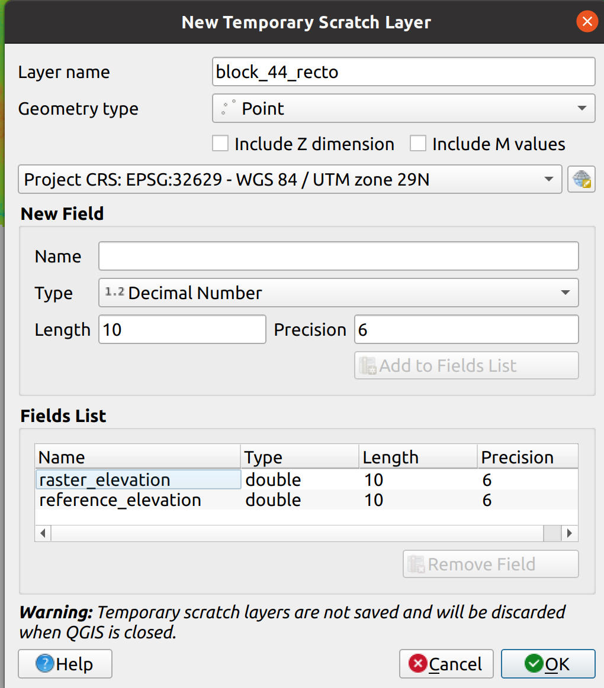

# Vertical Georeferencing of Digital Elevation Models (DEMs)

## Why?
Often we have DEMs produced from photogrammetry with poor baked-in vertical georeferencing. Usually this is because the vertical accuracy of the Global Navigation Satellite System (GNSS) receivers attached to the original drone or camera images is worse than the horizontal accuracy (this is a largely unavoidable limitation of GNSS due to the frequent presence of a large, opaque planet just below the receiver), and having sufficient high-precision Ground Control Points (GCPs) is time-consuming and expensive.

The nature of photogrammetry is such that processing large numbers of photos scales poorly, so for datasets where the area and resolution is such that it requires a lot of images, we end up splitting them into "sub-models"; individual processing blocs that must be stitched together later. This raises a few problems:
- The proccessing blocs are smaller than the dataset, so if Ground Control Points are available fewer will fall within each area
- Because there are fewer images per bloc than in the dataset, and therefore fewer GNSS points, there is less natural averaging of errors in the GNSS positions
- The edges often misalign, creating disconinuities at the seams that at best can be unsightly and at worst render the datasets unusable for things like hydrological modeling (mild seams can be effectively mitigated by smoothing the edges, as with Anna Petrosova's brilliant [GRASS GIS tool r.patch.smooth](https://github.com/petrasovaa/r.patch.smooth), but this isn't appropriate for medium to severe misalignment).

We can mitigate this by semi-manually adjusting the DEM raster elevations to align to align with any ground control points that fall within them as well as neighboring DEMs.

## How?
Conceptually, it's simple enough, but the devil is in the details!

First, wherever there are trusted GCPs or other regions where we have reason to believe the elevations are accurate, align the individual DEM blocs to them.
- If possible, simply raise or lower the blocs until they match all known high-accuracy elevations within them, great!
- If that's not possible, because the errors are not uniform, we need to tilt or even warp the blocs while adjusting the elevations until they align with all known high-accuracy points.

Second, warp the blocs to align their edges midway between their elevation differences.
- Create tie points where the blocs overlap, and calculate the differences between the elevations of each bloc at the tie points. Create mid-point elevations halfway in between the bloc elevations at teach tie point. 
- Create Triangular Interpolation Networks (TINs) for each bloc from the GCPs (or other known high-accuracy elevation points) within them, and the tie point mid-points. Use a cubic TIN so that the warping is smooth and doesn't create linear artifacts (choose a sensible resolution, perhaps 10x the original DEM resolution to save processing time; this should be a subtle operation anyway so the low resolution shouldn't be a problem).
- Add the TIN elevations to the bloc elevations arithmetically. At this point, by definition the bloc elevations will match exactly at the edges, and further more they are likely to be more absolutely accurate than the originals because, all other things being equal (i.e. unless some particular blocs have specific errors or biases for some reason), the errors will average out.
- Merge with smoothing using r.patch.smooth (we like to use a variable distance at the seam with a 1-degree max angle; this does a great job of preventing discontinuities that will mess up hydrological models).

## Details
A painful but working procedure using desktop QGIS and some GRASS GIS:

_Note: this recipe assumes substantial familiarity with GIS and we're not describing every button-click; if you don't already have a good working knowledge of GIS&mdash;at least QGIS, if not also GRASS&mdash;this is not a procedure you should be attempting on your own)._

Here is a DEM bloc that's globally too low (in this case it's actually due to a coordinate system mismatch, and we've fiddled the display parameters in QGIS just to illustrate that it's low; it's the blue one).


Note that there's a GCP inside the DEM bloc! Lucky us. Ok, let's lift the whole thing so that the elevation at the exact location of the GCP matches the GCP (which is in WGS84, the native GNSS Coordinate Reference System, which is a whole different set of problems but that's a topic for another markdown file). We use the ```Identify features``` tool in QGIS to find the raster elevation by clicking on that exact point whilst the DEM is selected (the elevation shows up on the right in the ```Identify Results``` window. Use simple addition (and/or subtraction if applicable) to raise or lower the entire raster until it matches the GCP elevation at that point.


Well, ok, now it matches the GCP, but it's clearly tilted! It's too high (orange) on the right, and too low (blue) on the left (here we have the QGIS display style set identically for all of the DEM blocs, so a visible discontinuity corresponds to an actual discontinuity in the data).


Right, let's assume that the neighboring DEMs are accurate (in this case they probably are because we've been working on aligning the DEMs for this area for several weeks straigh and this one is one of the last pieces to fit) and adjust the whole thing to match the neighbors, _while leaving the elevation at the GCP unchanged_; the GPC is our best reference and we don't want to mess with it). We're going to warp the whole bloc to match the neighbors.

First, draw a rough perimeter around the bloc, making sure it's well inside of any funky edge artifacts; we do _not_ want to warp the better-quality interior of our DEM to force the dodgy edges to meet the neighbors! We'll use that as a guide to place our tie points (and we're gonna trim the edges later anyway).


Actually it's a good idea to use the GRASS tool ```r.mask.vect``` to trim your raster using that perimeter right now. That takes time, so maybe go do something else for a while! (Also, do make sure that the perimeter is in the same Coordinate Reference System as the raster). 

Now let's create a set of tie points.



Guidelines:
- Keep all of the others near the perimeter so that they'll fall within the high-quality areas of the neighbors.
- Don't forget to include tie points _exactly_ a the location of any GCPs or other good references.
- Try to put them in places where the DEMs are likely consistent between one another without big jumps (i.e. aim for fields, roads, etc, _not_ buildings, vegetation, or other bumpy stuff). We sometimes use the ortho photos as a guide to promising tie point locations.
- Try to make the tie points dense where there are obvious changes in the mismatch between the DEM and its neighbors.

Then use the QGIS ```Raster analysis``` -> ```Sample raster values``` to get the elevation of the DEM you are georeferencing at each tie point. Set the ```Output column prefix``` to the name of the DEM so that you can later differentiate these values from the elevations of the neighbors. Note here the essentially perfect correlation between the DEM elevation and the GCP (because we got the previous step right). 


Now do the same for the neighboring rasters. Again set the ```Output column prefix``` to reflect the name of the rasters you're sampling, to ensure you know which value to use as a reference and which to correct. 


Use the ```Vector``` -> ```Geoprocessing tools``` -> ```Buffer``` to create tiny polygons (we use 1m diameter) from the neighbor samples (this allows us to join the two layers, there's no obvious way to join fields from two point layers even if the points are essentially identical, but it's easy to join fields from polygons that points fall within). Then use ```Vector``` -> ```Data management tools``` -> ```Join attributes by location``` with the DEM samples as the base layer and the buffered polygons of the neighbor samples as the join layer. That gives us a new point layer with both elevations. Use the Field Calculator to give the difference.

Note that we failed to correctly name the field of my neighbor elevations; fortunately we did so with the DEM we're referencing so we got away with it.


## NEXT STEPS TO DESCRIBE
I rushed through this without documenting; will get to it later.

- Duplicate the correction layer and drag the points outside of the perimeter so that it will form a convext hull that fully encloses the DEM.
- Make a TIN out of it, with large cell size, the DEM as reference layer for CRS etc, and cubic, not linear.
- Add the TIN to the DEM with the Raster Calculator.
- Check out the resulting raster, which should match nicely everywhere.
- If so, export it, drag it into Grass, and r.patch.smooth it with a 1-degree slope.